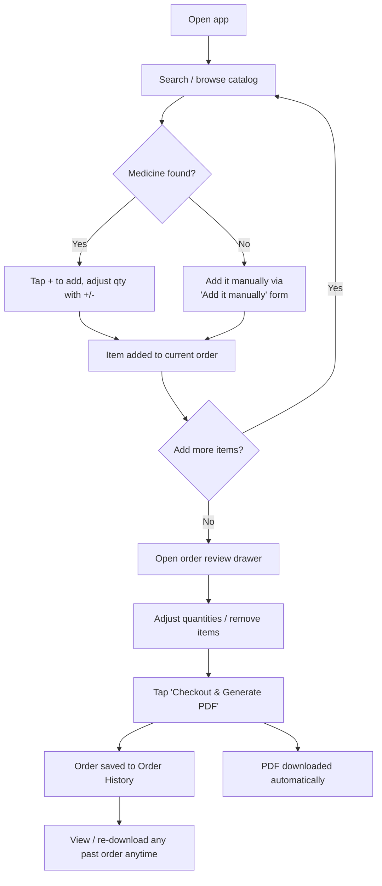
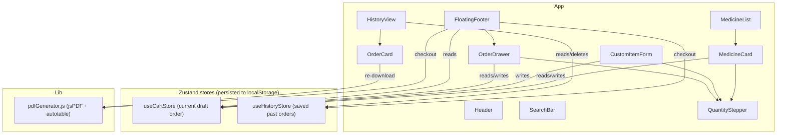
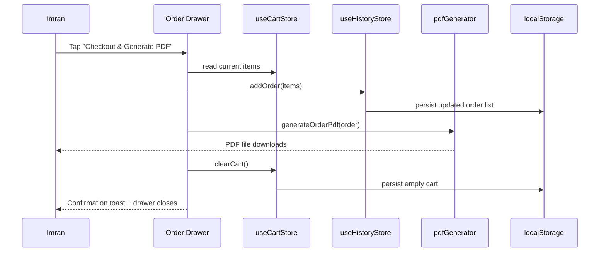
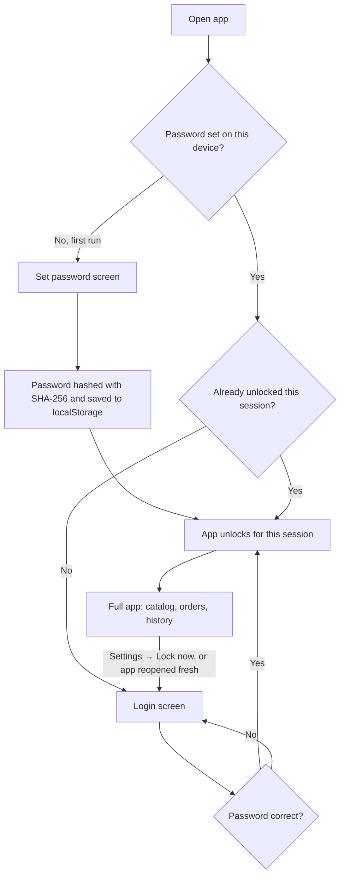

# Imran Pharmacy

A lightweight, installable Progressive Web App for browsing a medicine catalog, building an order by quantity, checking out, and exporting the order as a PDF — all client-side, no backend, works offline once installed.

Built with **React + Vite**, **Tailwind CSS**, **Zustand** (with `localStorage` persistence), **jsPDF**, and **vite-plugin-pwa**.

---

## Table of contents

1. [What it does](#what-it-does)
2. [How it works (diagrams)](#how-it-works)
3. [Password protection](#password-protection)
4. [Project structure](#project-structure)
5. [Run it from scratch — step by step](#run-it-from-scratch)
6. [Using the app](#using-the-app)
7. [Updating the medicine catalog](#updating-the-medicine-catalog)
8. [Deploying to GitHub Pages](#deploying-to-github-pages)
9. [Data & storage notes](#data--storage-notes)

---

## What it does

- **Catalog** of 1,908 real medicine names, pulled from Imran own stock report, searchable in real time.
- **Quantity-only ordering** — tap `+` / `–` next to any medicine to add it to the current order. No prices, no stock limits, no expiry tracking — just what to order and how much.
- **Custom items** — if a medicine isn't in the catalog, Imran can type its name directly and add it to the order alongside catalog items.
- **A–Z filtering** — tap a letter to filter medicines by starting letter, plus an **Other** bucket for non-letter items.
- **Favorites support** — mark common medicines as favorites and have them surface at the top of the catalog.
- **Batch import via CSV** — upload a `name,qty` file to add catalog or custom medicines in bulk.
- **Prescription notes** — attach a note to each order item inside the review drawer before checkout.
- **Bulk order templates** — save the current order as a reusable template and apply it later.
- **Order review drawer** — a slide-up panel listing everything currently in the order, with the ability to adjust quantities or remove items before checkout.
- **Checkout** — saves the order permanently to **Order History** and immediately downloads a PDF order list.
- **Order History** — every past checkout is saved locally on the device, and any order's PDF can be regenerated and re-downloaded at any time.
- **Installable PWA** — add it to the home screen on mobile or install as a desktop app; works without an internet connection after first load.
- **Password-protected** — the app is locked behind a password on first run; nobody sees the catalog or order data on a shared device without it.
- **Dark / light mode** toggle.

---

## How it works

### User flow



### Component architecture



### Checkout sequence



---

## Password protection

The whole app is gated behind a password before any catalog, order, or history data is shown.



**How it behaves:**
- **First run on a device** → Imran (or whoever sets it up) chooses a password. It's hashed with SHA-256 before being saved — the plain password is never stored anywhere.
- **Every subsequent open** (fresh page load, browser restart, or relaunching the installed PWA) → the password is required again. It does *not* stay unlocked forever, so leaving the app open doesn't leave it open to the next person who picks up the device.
- **Change password** → Header → gear icon → Settings → enter current + new password.
- **Lock immediately** → Settings → "Lock now" — useful right before handing the device to someone else.
- **Forgot password** → Login screen → "Forgot password?" → resets *only* the password (catalog, current order, and order history are untouched) so a new one can be set.

**Please read this honestly, though:** since this is a fully static site with no backend server, this password is a **privacy lock for a shared device**, not real access-control security. Anyone with browser developer tools on that specific device could, in principle, inspect or clear local app storage directly. It's meant to stop a casual person from opening the app and seeing the order data — not to withstand a determined attacker with access to the device.

---

## Project structure

Components are grouped by **feature area** (not dumped flat into one folder), so each piece is easy to find and change independently:

```
imran-pharmacy/
├── index.html
├── vite.config.js            # GitHub Pages base path + PWA manifest
├── tailwind.config.js
├── postcss.config.js
├── package.json              # scripts incl. predeploy/deploy for GitHub Pages
├── README.md
├── public/                   # put icon-192x192.png / icon-512x512.png here
└── src/
    ├── main.jsx               # React entry point (wraps App in HashRouter)
    ├── App.jsx                 # routes + wraps everything in <LoginGate>
    ├── index.css               # Tailwind + global styles
    ├── data/
    │   └── medicines.json      # the base catalog (id + name)
    ├── store/                  # Zustand stores, each persisted to localStorage
    │   ├── useAuthStore.js      # password hash + unlocked state
    │   ├── useCartStore.js      # current draft order, favorites, templates
    │   ├── useCatalogStore.js   # catalog medicines (incl. manually added ones)
    │   └── useHistoryStore.js   # saved past orders
    ├── lib/
    │   ├── hashPassword.js      # SHA-256 hashing via Web Crypto API
    │   ├── pdfGenerator.js      # builds & downloads the order PDF
    │   ├── formatDate.js        # human-friendly date formatting
    │   └── useTheme.js          # dark/light mode hook
    └── components/
        ├── auth/                # password gate
        │   ├── LoginGate.jsx      # decides which screen below to show
        │   ├── SetPasswordScreen.jsx  # first-run password setup
        │   └── LoginScreen.jsx    # returning-user unlock screen
        ├── layout/
        │   └── Header.jsx        # top bar: nav, order badge, theme toggle
        ├── catalog/              # browsing & building the order
        │   ├── SearchBar.jsx       # search + A–Z letter filter
        │   ├── MedicineList.jsx    # catalog list + favorite/qty controls
        │   ├── CustomItemForm.jsx  # "not in the list" manual entry
        │   ├── CatalogManager.jsx  # add/remove catalog entries permanently
        │   └── CsvImport.jsx       # bulk `name,qty` CSV import
        ├── order/                # the in-progress order
        │   ├── FloatingFooter.jsx  # summary bar + review drawer + checkout
        │   └── TemplateManager.jsx # favorites & reusable order templates
        ├── history/
        │   └── HistoryView.jsx     # past orders, re-download PDF
        ├── settings/
        │   └── SettingsPage.jsx    # change password, lock now
        ├── info/
        │   ├── AboutPage.jsx       # "Features" page
        │   └── FeatureGuide.jsx    # in-catalog feature list card
        └── common/
            └── QuantityStepper.jsx # shared +/- stepper used everywhere
```

---

## Run it from scratch

These are the **exact steps**, in order, to get the app running on your machine — assuming you're starting from the unzipped project folder.

### Step 1 — Install Node.js

You need Node.js 18 or newer. Check with:

```bash
node -v
```

If you don't have it, download it from [nodejs.org](https://nodejs.org).

### Step 2 — Install dependencies

From inside the `imran-pharmacy` folder:

```bash
cd imran-pharmacy
npm install
```

This installs React, Vite, Tailwind, Zustand, jsPDF, and the PWA plugin — everything listed in `package.json`.

### Step 3 — Add your app icons

Drop two PNG files into the `public/` folder:
- `public/icon-192x192.png`
- `public/icon-512x512.png`

(These are what shows up as the app icon when installed on a phone or desktop. Any square logo works — you can generate these sizes from one image using a free tool like realfavicongenerator.net.)

### Step 4 — Run it locally

```bash
npm run dev
```

Vite will print a local URL (usually `http://localhost:5173`). Open it in your browser — the app is now running.

### Step 5 — Try it out

- Search for a medicine, tap `+` a few times.
- Tap the floating bar at the bottom to review the order.
- Try "Add it manually" for something not in the catalog.
- Tap **Checkout & Generate PDF** — a PDF should download and the order should appear under the **History** tab.

### Step 6 — Build for production

```bash
npm run build
```

This creates an optimized `dist/` folder. Preview it locally with:

```bash
npm run preview
```

### Step 7 — Deploy (optional)

See [Deploying to GitHub Pages](#deploying-to-github-pages) below.

---

## Using the app

| Action | How |
|---|---|
| Find a medicine | Type in the search bar at the top — filters instantly across all 1,908 names |
| Add to order | Tap `+` on any medicine card |
| Change quantity | Tap `+` / `–` again, on the card or in the review drawer, or type a number directly into the quantity field |
| Order something not in the catalog | Scroll to the bottom of the list → "Can't find a medicine? Add it manually" → type name, set quantity, tap **Add** |
| Filter by letter | Use the A–Z buttons above the catalog to show only medicines starting with that letter, or tap **Other** for non-letter items |
| Favorite a medicine | Tap the star icon on a medicine card to pin it to the top of the list |
| Batch import orders | Use the CSV upload section to import `name,qty` rows and add them to the cart |
| Add a prescription note | In the review drawer, type a note for each item before checkout |
| Save a template | Use the templates section to save the current cart and reuse it later |
| Review the full order | Tap the floating bar at the bottom of the screen |
| Remove an item | In the review drawer, tap the trash icon next to it |
| Finish the order | In the review drawer, tap **Checkout & Generate PDF** — this saves it to History *and* downloads the PDF |
| See past orders | Tap **History** in the header |
| Re-download an old order's PDF | History → tap an order to expand it → **Download PDF again** |
| Delete a past order | History → expand it → trash icon |
| Switch dark/light mode | Sun/moon icon, top right |
| Change the app password | Header → gear icon → **Settings** |
| Lock the app immediately | Settings → **Lock now** |

---

## Updating the medicine catalog

Edit `src/data/medicines.json`. Each entry only needs an `id` and a `name`:

```json
{ "id": 1, "name": "Panadol 500mg Tab" }
```

Add, remove, or rename entries as needed, then rebuild (`npm run build`) or just save while `npm run dev` is running — it hot-reloads automatically.

---

## Deploying to GitHub Pages

```bash
# One-time setup
git init
git add .
git commit -m "Initial commit"
git branch -M main
git remote add origin https://github.com/<your-username>/imran-pharmacy.git
git push -u origin main

# Deploy (builds automatically via the predeploy script)
npm run deploy
```

Then in your GitHub repo: **Settings → Pages → Source → branch `gh-pages`**.

Your app will be live at:
`https://<your-username>.github.io/imran-pharmacy/`

> **Important:** if your repository name isn't `imran-pharmacy`, update the `base` path in `vite.config.js`, the `start_url` / `scope` in its PWA manifest block, and `homepage` in `package.json` to match.

---

## Data & storage notes

- **Catalog data** (`medicines.json`) ships inside the app bundle — it's static and doesn't change unless you edit the file and rebuild.
- **Current order** and **order history** are saved in the browser's `localStorage`, scoped to the device/browser Imran is using. This means:
  - Orders persist across page refreshes and app restarts.
  - Orders do **not** sync between devices (e.g. Imran phone and a shop computer are separate).
  - Clearing browser data / site data will erase the order history.
- No data is sent anywhere — everything runs entirely in the browser, which is also what makes the installed PWA work fully offline.
